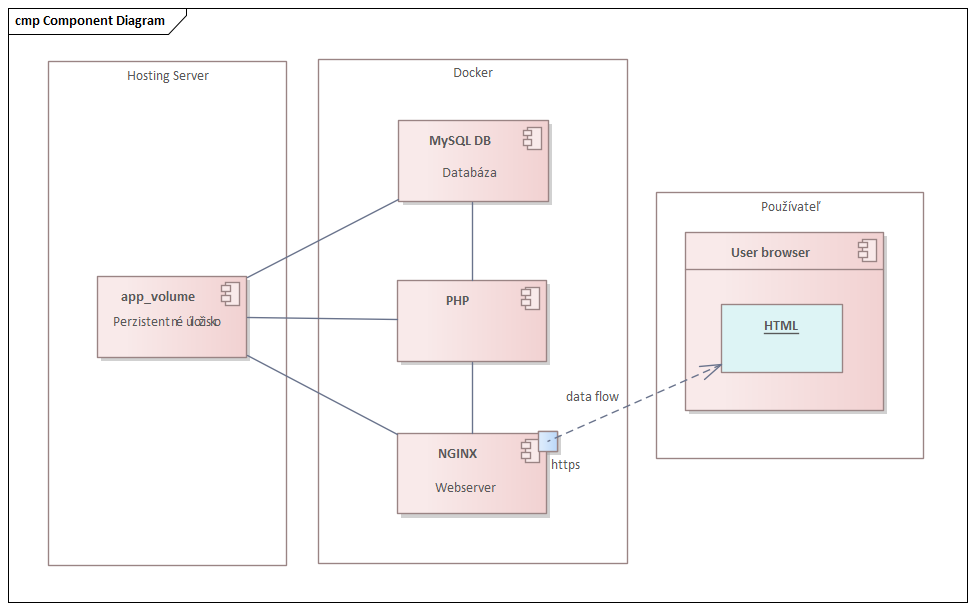
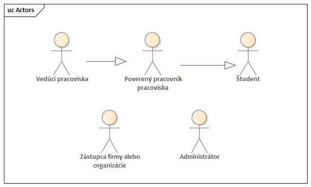
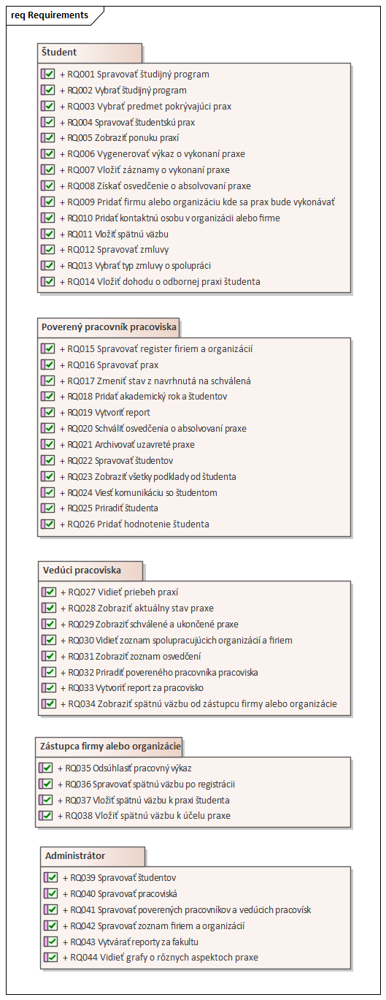
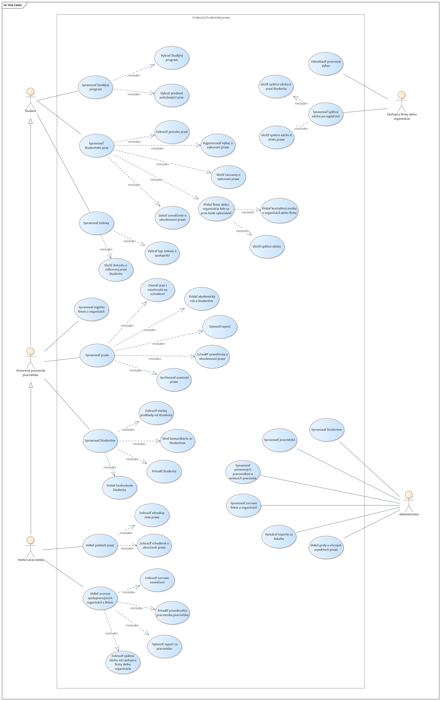
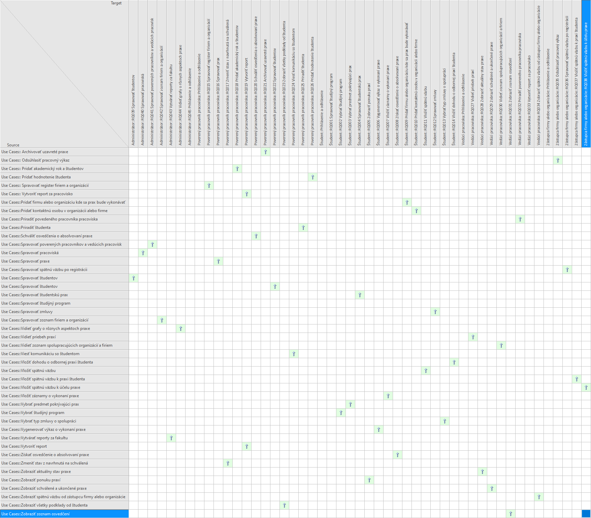
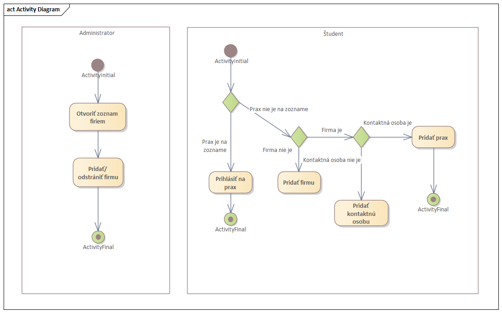
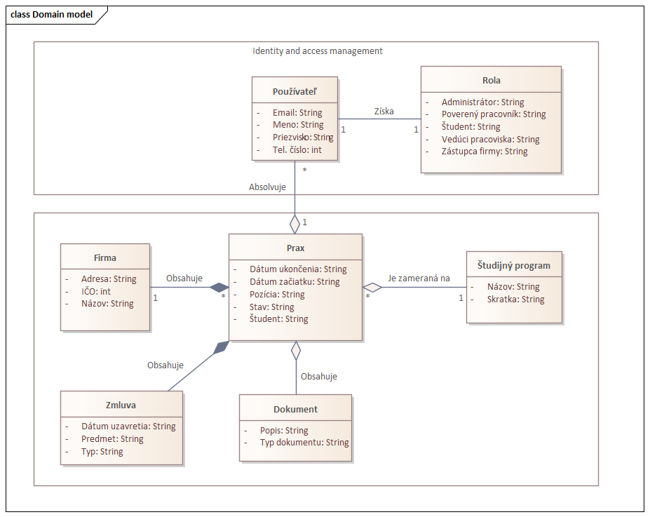
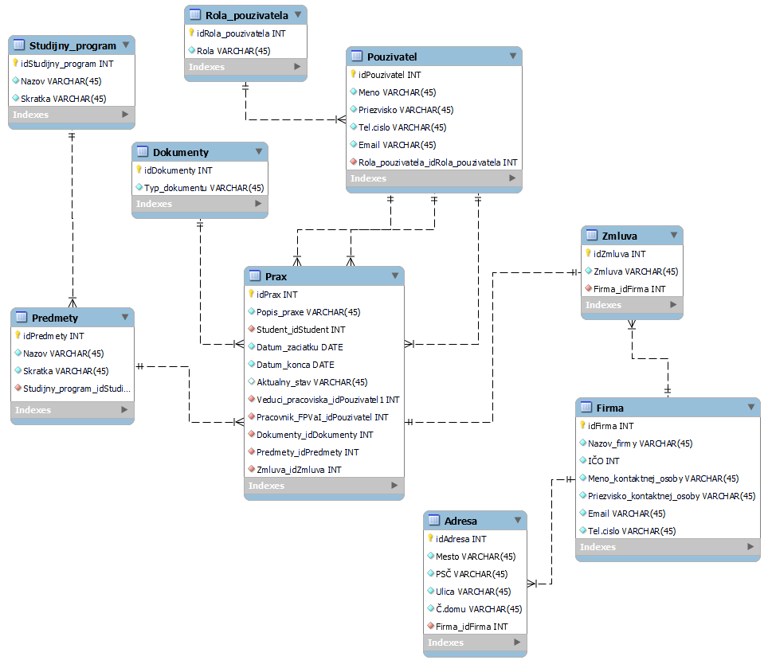

# team4ukf
Tento projekt je zameraný na evidenciu študentskej praxe, poskytujúci riešenie pre správu a monitorovanie praxí študentov.
Nižšie sú uvedené detaily pre jednotlivé časti systému.

## Diagram komponentov
Diagram komponentov vizualizuje architektúru systému a vzájomné vzťahy medzi jeho hlavnými komponentami.

## Zoznam rolí
Zoznam rolí identifikuje a opisuje jednotlivé úlohy a práva pridelené používateľom alebo entitám v systéme.

## Zoznam požiadaviek
Zoznam požiadaviek obsahuje detailné informácie o funkcionalitách a vlastnostiach, ktoré systém musí spĺňať.

| Názov                                                     | Popis                                                                                              |
|-----------------------------------------------------------|----------------------------------------------------------------------------------------------------|
| Študent                                                   |                                                                                                    |
| Spravovať študijný program                                | Ako Študent chcem mať možnosť spravovať študíjny program.                                          |
| Vybrať študijný program                                   | Ako Študent chcem mať možnosť vybrať študíjny program.                                             |
| Vybrať predmet pokrývajúci prax                           | Ako Študent chcem mať možnosť vybrať predmet pokrývajúci prax                                      |
| Spravovať študentskú prax                                 | Ako Študent chcem mať možnosť spravovať študentskú prax                                            |
| Zobraziť ponuku praxí                                     | Ako Študent chcem mať možnosť zobrazovať ponuku praxí.                                             |
| Vygenerovať výkaz o vykonaní praxe                        | Ako Študent chcem mať možnosť vygenerovať výkaz o vykonaní praxe.                                  |
| Vložiť záznamy o vykonaní praxe                           | Ako Študent chcem mať možnosť vložiť záznamy o vykonaní praxe.                                     |
| Získať osvedčenie o absolvovaní praxe                     | Ako Študent chcem mať možnosť získať osvedčenie o absolvovaní praxe.                               |
| Pridať firmu alebo organizáciu kde sa prax bude vykonávať | Ako Študent chcem mať možnosť pridať firmu alebo organizáciu kde sa prax bude vykonávať.           |
| Pridať kontaktnú osobu v organizácii alebo firme          | Ako Študent chcem mať možnosť pridať kontaktnú osobu v organizácii alebo firme.                    |
| Vložiť spätnú väzbu                                       | Ako Študent chcem mať možnosť vložiť spätnú väzbu.                                                 |
| Spravovať zmluvy                                          | Ako Študent chcem mať možnosť spravovať zmluvy.                                                    |
| Vybrať typ zmluvy o spolupráci                            | Ako Študent chcem mať možnosť vybrať typ zmluvy o spolupráci.                                      |
| Vložiť dohodu o odbornej praxi študenta                   | Ako Študent chcem mať možnosť vložiť dohodu o odbornej praxi Študenta.                             |
| Poverený pracovník pracoviska:                            |                                                                                                    |
| Spravovať register firiem a organizácií                   | Ako poverený pracovník pracoviska chcem mať možnosť spravovať register firiem a organizácií.       |
| Spravovať prax                                            | Ako poverený pracovník pracoviska chcem mať možnosť spravovať prax.                                |
| Zmeniť stav z navrhnutá na schválená                      | Ako poverený pracovník pracoviska chcem mať možnosť zmeniť stav z navrhnutá na schválená.          |
| Pridať akademický rok a študentov                         | Ako poverený pracovník pracoviska chcem mať možnosť pridať akademický rok a študentov.             |
| Vytvoriť report                                           | Ako poverený pracovník pracoviska chcem mať možnosť vytvoriť report.                               |
| Schváliť osvedčenia o absolvovaní praxe                   | Ako poverený pracovník pracoviska chcem mať možnosť schváliť osvedčenia o absolvovaní praxe.       |
| Archivovať uzavreté praxe                                 | Ako poverený pracovník pracoviska chcem mať možnosť archivovať uzavreté praxe.                     |
| Spravovať študentov                                       | Ako poverený pracovník pracoviska chcem mať možnosť spravovať študentov.                           |
| Zobraziť všetky podklady od študenta                      | Ako poverený pracovník pracoviska chcem mať možnosť zobraziť všetky podklady od študenta.          |
| Viesť komunikáciu so študentom                            | Ako poverený pracovník pracoviska chcem mať možnosť viesť komunikáciu so študentom.                |
| Priradiť študenta                                         | Ako poverený pracovník pracoviska chcem mať možnosť priradiť študenta.                             |
| Pridať hodnotenie študenta                                | Ako poverený pracovník pracoviska chcem mať možnosť pridať hodnotenie študenta.                    |
| Vedúci pracoviska:                                        |                                                                                                    |
| Vidieť priebeh praxí                                      | Ako vedúci úracoviska chcem mať možnosť vidieť priebeh praxí.                                      |
| Zobraziť aktuálny stav praxe                              | Ako vedúci úracoviska chcem mať možnosť zobraziť aktuálny stav praxe.                              |
| Zobraziť schválené a ukončené praxe                       | Ako vedúci úracoviska chcem mať možnosť zobraziť schválené a ukončené praxe.                       |
| Vidieť zoznam spolupracujúcich organizácií a firiem       | Ako vedúci úracoviska chcem mať možnosť vidieť zoznam spolupracujúcich organizácií a firiem.       |
| Zobraziť zoznam osvedčení                                 | Ako vedúci úracoviska chcem mať možnosť                                                            |
| Priradiť povereného pracovníka pracoviska                 | Ako vedúci úracoviska chcem mať možnosť priradiť povereného pracovníka pracoviska.                 |
| Vytvoriť report za pracovisko                             | Ako vedúci úracoviska chcem mať možnosť vytvoriť report za pracovisko.                             |
| Zobraziť spätnú väzbu od zástupcu firmy alebo organizácie | Ako vedúci úracoviska chcem mať možnosť zobraziť spätnú väzbu od zástupcu firmy alebo organizácie. |
| Zástupca firmy alebo organizácie:                         |                                                                                                    |
| Odsúhlasiť pracovný výkaz                                 | Ako zástupca firmy alebo organizácie chcem mať možnosť odsúhlasiť pracovný výkaz.                  |
| Spravovať spätnú väzbu po registrácii                     | Ako zástupca firmy alebo organizácie chcem mať možnosť spravovať spätnú väzbu po registrácii.      |
| Vložiť spätnú väzbu k praxi študenta                      | Ako zástupca firmy alebo organizácie chcem mať možnosť vložiť spätnú väzbu k praxi študenta.       |
| Vložiť spätnú väzbu k účelu praxe                         | Ako zástupca firmy alebo organizácie chcem mať možnosť vložiť spätnú väzbu k účelu praxe.          |
| Administrátor:                                            |                                                                                                    |
| Spravovať študentov                                       | Ako administrátor chcem mať možnosť spravovať študentov.                                           |
| Spravovať pracoviská                                      | Ako administrátor chcem mať možnosť spravovať pracoviská.                                          |
| Spravovať poverených pracovníkov a vedúcich pracovísk     | Ako administrátor chcem mať možnosť spravovať poverených pracovníkov a vedúcich pracovísk.         |
| Spravovať zoznam firiem a organizácií                     | Ako administrátor chcem mať možnosť spravovať zoznam firiem a organizácií                          |
| Vytvárať reporty za fakultu                               | Ako administrátor chcem mať možnosť vytvárať reporty za fakultu.                                   |
| Vidieť grafy o rôznych aspektoch praxe                    | Ako administrátor chcem mať možnosť vidieť grafy o rôznych aspektoch praxe.                        |

## Prípady použitia
Prípady použitia popisujú interakcie medzi používateľmi a systémom, zohľadňujúc rôzne scenáre a ich kroky.

## Matica vzťahov požiadaviek
Matica vzťahov požiadaviek zobrazuje vzťahy medzi jednotlivými požiadavkami a identifikuje ich závislosti a prioritizáciu.

## Diagram aktivít
Diagram aktivít zachytáva postupnosť krokov alebo aktivít v určitom procese a vizualizuje ich vzťahy.

## Doménový model
Doménový model reprezentuje hlavné entitné objekty a ich vzťahy v rámci systému, pomáhajúc pochopiť jeho celkovú štruktúru.

## Databázový model
Databázový model definuje štruktúru databázy, tabuliek a vzťahy medzi nimi, ktoré sú potrebné na ukladanie a správu dát v systéme.

